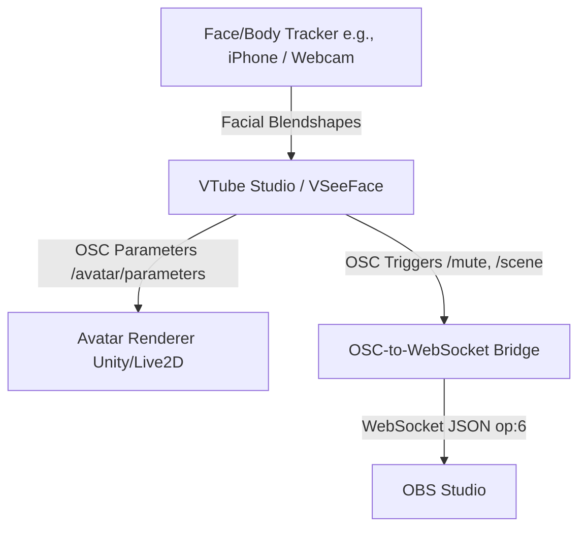

# OBS Studio OSC Integration & Plugin Landscape Guide

This document provides a comprehensive overview of controlling and automating OBS Studio via Open Sound Control (OSC) and WebSocket protocols. It details the available plugin ecosystem, the historical split and controversies surrounding OBS derivatives, and the strategic importance of OSC parameters in the VTuber (Virtual YouTuber) community.

---

## 1. The OBS OSC & WebSocket Plugin Landscape

Because OBS Studio does not natively support the OSC protocol, the community has developed two distinct architectural patterns to enable external control (e.g., from QLab, Ableton Live, or Model Context Protocol integrations).

### A. The Native C++ Plugin Approach
These are compiled binary plugins (`.dll` on Windows, `.so` on Linux, `.plugin` on macOS) that load directly into OBS Studio's plugin directory and launch a UDP server.
* **[OBSC (benaclejames/OBSC)](https://github.com/benaclejames/OBSC)**: Designed for low-latency, bidirectional event transmission. It maps OBS scene transitions, audio volume, and visibility toggles directly to static UDP OSC ports.
* **[ObSC (CarloCattano/ObSC)](https://github.com/CarloCattano/ObSC)**: A developer-oriented plugin that provides mapping of OBS functions to simple OSC addresses, though it requires specific build chains and dependencies.
* **Pros**: No external processes or translation layers are required; lowest possible latency.
* **Cons**: Highly sensitive to OBS version upgrades (frequently crashes or breaks during major releases); requires manual binary copying to system paths; platform-dependent compilation.

### B. The WebSocket Middleware / Bridge Approach
Starting in OBS Studio v28, a high-performance **obs-websocket** server is bundled natively with the installation. This server uses a JSON-RPC over WebSockets protocol (OBS WebSocket v5) to enable full, authenticated control over every facet of OBS.
* **[OSC-for-OBS (jshea2/OSC-for-OBS)](https://github.com/jshea2/OSC-for-OBS)**: An Electron-based desktop application that acts as a bridge. It listens for incoming OSC UDP messages, translates them, and forwards them as WebSocket JSON payloads.
* **Built-in Python Bridge (`scripts/obs_websocket_bridge.py`)**: Our lightweight Python utility included in this repository. It listens on UDP port `7000` for basic OSC addresses (`/scene`, `/mute`, `/volume`, `/stream/start`, `/stream/stop`) and converts them into OBS v5 WebSocket commands on port `4455` using standard libraries.
* **Pros**: Highly stable and unaffected by OBS binary updates; supports authentication/passwords natively; works out of the box with zero OBS plugin installation steps.
* **Cons**: Adds a microsecond translation latency due to the extra hop, though negligible for live production.

---

## 2. Retrospective: The Streamlabs (SLOBS) vs. OBS Studio Split

The OBS ecosystem experienced a major corporate-vs-open-source conflict between 2018 and 2021, which fundamentally shaped the landscape of streaming software.

### The Trademark Battle & SLOBS Fork
* **The Cloned Product**: Streamlabs (a division of Logitech) created a custom frontend for the open-source OBS Studio backend called **Streamlabs OBS (SLOBS)**. By bundling Streamlabs' widget ecosystem directly into the app, it offered a simplified, one-click setup.
* **The Dispute**: The OBS Project team requested that Streamlabs refrain from using the name "OBS" in their product to prevent brand confusion. Streamlabs declined and proceeded to file a US trademark application for "Streamlabs OBS."
* **Public Backlash (November 2021)**: The conflict erupted when the OBS Project publicly disclosed on Twitter that Streamlabs had ignored their naming requests. Simultaneously, cloud-streaming service **Lightstream** accused Streamlabs of copying their website design and customer reviews verbatim.
* **The Resolution**: Facing a massive boycott from top streamers (including Pokimane, HasanAbi, and Jacksepticeye), Streamlabs withdrew their trademark application and rebranded their software to **Streamlabs Desktop**. A formal agreement was signed in December 2021 to support open-source collaboration.

### Why It Matters to Integrations
The controversy solidified **OBS Studio** as the undisputed, ethically supported standard for professional developers. Almost all modern plugin development, including WebSocket integrations and Model Context Protocol (MCP) integrations, targets official OBS Studio APIs rather than proprietary forks like Streamlabs Desktop.

---

## 3. VTubers, OSC, and Event-Driven OBS Automation

Virtual YouTubers (VTubers) utilize real-time computer vision and tracking applications to animate 2D or 3D characters. In this community, OSC is the default data transport protocol.

### Tracking Apps as OSC Sources
VTuber tracking software, such as **VTube Studio** (for Live2D) and **VSeeFace** (for 3D), outputs tracking variables and expression state data using standard OSC addresses (e.g., `/avatar/parameters/MouthOpen`, `/avatar/parameters/Sad`).

### Automating OBS via Avatar State
By bridging these OSC parameters to OBS, VTubers can build dynamic, automated setups:
* **Auto-Mute on Mute-Face**: If the camera tracks the VTuber putting a hand over their mouth (or triggering a "mute" expression), the tracking software transmits an OSC trigger that mutes their OBS audio source.
* **Emotion-Driven Scene Swapping**: A VTuber triggering an "Angry" or "Rage" expression can trigger an OSC message that switches the OBS scene to a red-themed gameplay layout with screen shake.
* **Interactive Chat Avatar Toggles**: External chat-bot triggers (from Twitch/YouTube integrations) send OSC messages that update OBS scene layers or toggle custom virtual camera parameters.

---

## 4. Bibliography & References

1. **OBS WebSocket v5 Protocol Specification**:
   * Official Protocol Docs: [OBS WebSocket GitHub Resource](https://github.com/obsproject/obs-websocket/blob/master/docs/generated/protocol.md)
2. **Streamlabs Trademark Controversy Retrospectives**:
   * PC Gamer Coverage: *The Streamlabs OBS branding controversy explained* (November 2021).
   * Plagiarism Today: *The Streamlabs, OBS Studio and Lightstream Controversy* (December 2021).
3. **VTuber OSC Tracking Standards**:
   * VTube Studio Manual: [VTube Studio OSC API Integration Guide](https://github.com/DenchiSoft/VTubeStudio/wiki/OSC-Interface)
   * VSeeFace documentation: [OSC Blendshape and Receiver protocol](https://www.vseeface.icu/#osc-receiver)
4. **Relevant GitHub Bridging Repositories**:
   * [jshea2/OSC-for-OBS](https://github.com/jshea2/OSC-for-OBS) - Electron-based desktop WebSocket bridge.
   * [bbernstein/obsosc-py](https://github.com/bbernstein/obsosc-py) - Python OSC wrapper for OBS WebSocket.
